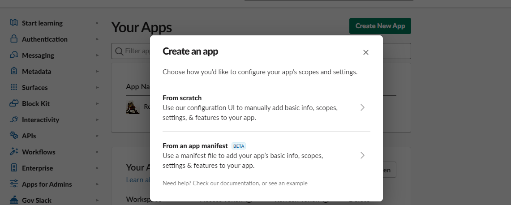
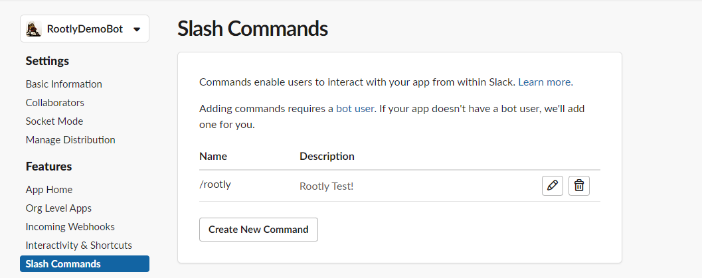
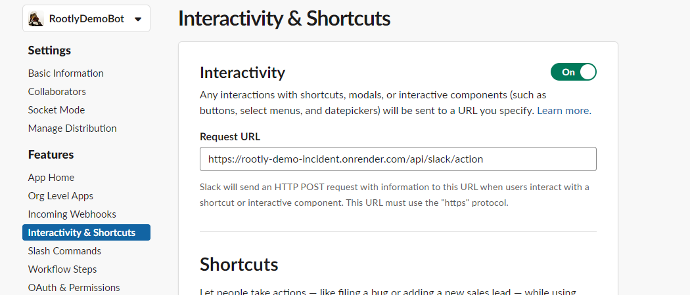
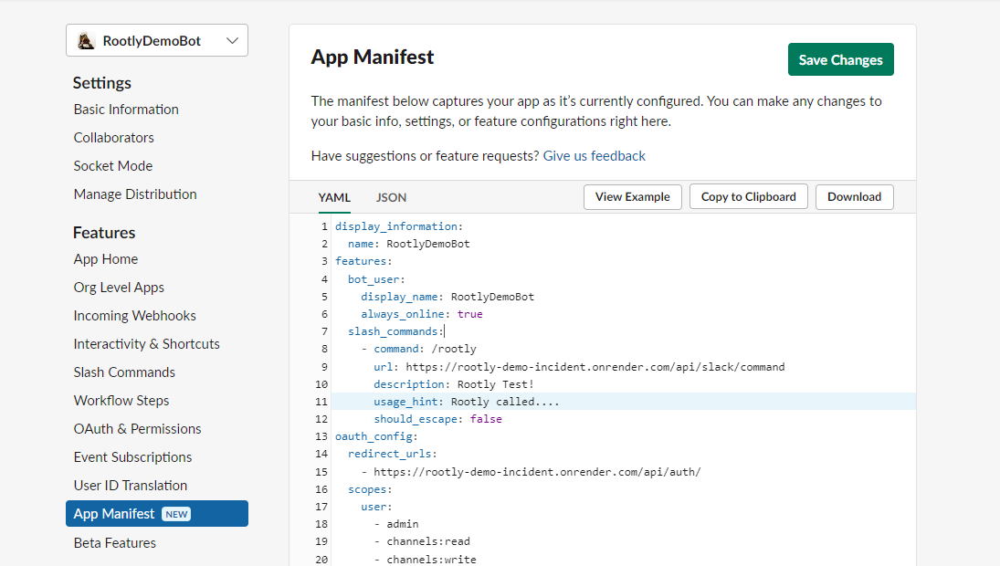
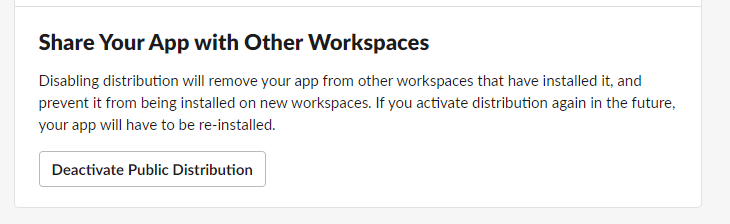
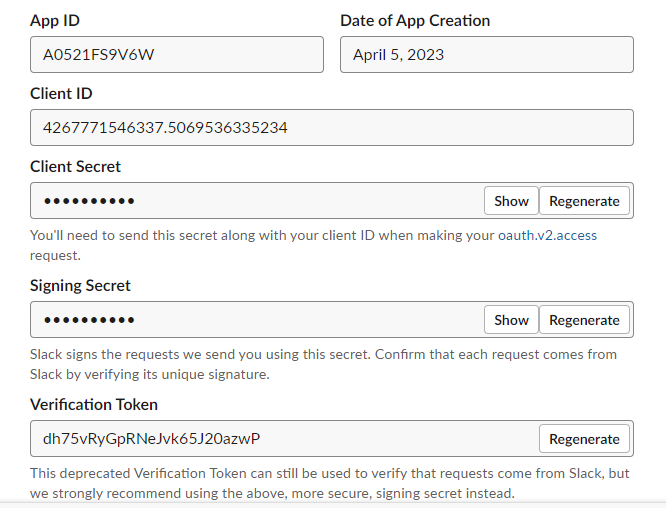
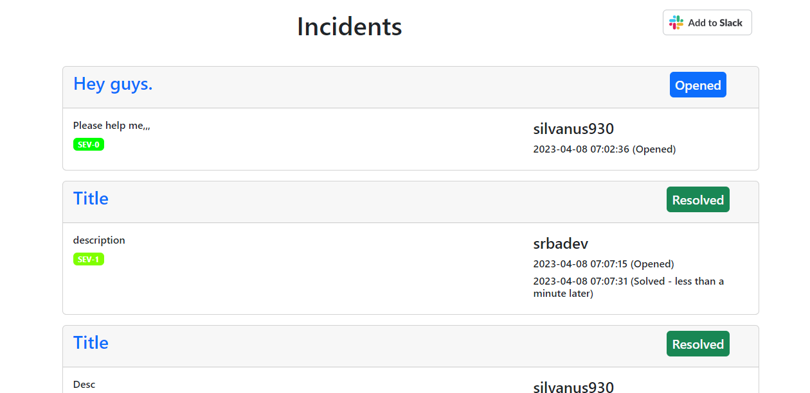
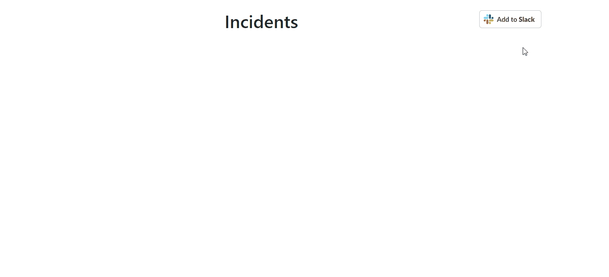

# Development process

## Name: **RootlyDemoBot**
## Environment:
- ruby 3.2.2 (2023-03-30 revision e51014f9c0) [x64-mingw-ucrt]

## Table of contents
---

- [Step1. Create a new Slack App](#step1-create-a-new-slack-app)
- [Step2. Create a new Rails app and setup the environment](#step2-create-a-new-rails-app-and-setup-the-environment)
- [Step3. Implement `Slack Commands` and `Slack Actions`](#step3-implement-slack-commands-and-slack-actions)
- [Step4. App's Auth flow set](#step4-apps-auth-flow-set)
- [Step5. Making Simple WEB UI](#step5-making-simple-web-ui)
- [Step6. Local testing using `ngrok`](#step6-local-testing-using-ngrok)

---
## Step1. Create a new Slack App

- Go to https://api.slack.com/apps and click on "Create New App".

- Give the app a name and select the workspace where you want to install the app.
- In the "Add features and functionality" section, click on "Slash Commands" and create two new commands with the following settings:
    - Command: `/rootly`
    - Request URL: https://your-app-domain.com/api/slack/command
    - Short Description: Declare/Resolve a new incident
    
- In the `Interactivety & Shortcuts`, set the `Request URL` as to like this `https://rootly-demo-incident.onrender.com/api/slack/action`
    
- In the "Basic Information" section in the Settings tab in Left nav, you can show `Client ID`, `Client Secret`, `Signing Secret` in the "App Credentials". This will be used to getting `bot token` and on the `App auth flow`.
### Simply you can set environments with `App Manifest`

Open the "App mainfests" in the Left nav, then past this code. After paste this code then click `Save Chanes`.

```json
{
    "display_information": {
        "name": "RootlyDemoBot"
    },
    "features": {
        "bot_user": {
            "display_name": "RootlyDemoBot",
            "always_online": true
        },
        "slash_commands": [
            {
                "command": "/rootly",
                "url": "https://your-domain.com/api/slack/command",
                "description": "Rootly Test!",
                "usage_hint": "Rootly called...",
                "should_escape": false
            },
        ]
    },
    "oauth_config": {
        "redirect_urls": [
            "https://your-domain.com/api/auth/"
        ],
        "scopes": {
            "bot": [
                "channels:manage",
                "channels:read",
                "chat:write",
                "commands",
                "groups:read",
                "incoming-webhook",
                "users:read",
                "channels:join"
            ]
        }
    },
    "settings": {
        "interactivity": {
            "is_enabled": true,
            "request_url": "https://your-domain.com/api/slack/action"
        },
        "org_deploy_enabled": true,
        "socket_mode_enabled": false,
        "token_rotation_enabled": true
    }
}
```


- After installed all of the evironment you can install this app to your workspace to local testing.
- If you want this app to install to other workspace you should use "Share Your APP with Any Workspace" on the "Manage Distribution" in the Left nav. 


## Step2. Create a new Rails app and setup the environment

### Open a terminal and run the following command to create as new Rails app
    rails new RootlyDemoBot --database=postgresql
### Bundle install
- Open the `Gemfile` in your text editor and add the following gems:

```ruby
gem "bootstrap"

gem 'irb'
gem 'pg'
gem 'dotenv'
gem 'newrelic-slack-ruby-bot'
gem 'slack-ruby-bot-server', '>= 1.1.0'
gem 'slack-ruby-client'
# we can't use this library in this project, but If you can use this library for future's features.
# gem 'slack-ruby-bot-server-events'

# this libraries is used for database
gem 'activerecord', require: 'active_record'
gem 'otr-activerecord'
gem 'pagy_cursor'
```
- Run the following command to install the new gems:
```
bundle install
```

### Making new controllers
Run this commands on the console
```
rails g controller Pages, SlackActions, SlackCommands, Auth
```

### Setting Environments
- Make the new `.env` file in the root folder, then open it
```
SLACK_CLIENT_ID=<YOUR-APP-CLIENT-ID>
SLACK_CLIENT_SECRET=<YOUR-APP-CLIENT-SECRET>
SLACK_SIGNING_SECRET=<YOUR-APP-SIGNING-SECRET>
SLACK_VERIFICATION_TOKEN=<YOUR-APP-VERIFICATION-TOKEN>
SLACK_BOT_TOKEN=<YOUR-APP-BOT-TOKEN>
```
- You can get this values from "Basic Information" on your Slack app project.



### Database Setting & migration
- Open the `database.yml` file and then edit the some values

```yml
development:
  <<: *default
  host: <YOUR-DEVELOPMEN-DATABASE-URL>
  username: <dev-db-user-name>
  database: <dev-db-name>
  password: <dev-db-password>

production:
  <<: *default
  host: <YOUR-PRODUCTION-DATABASE-URL>
  username: <prod-db-user-name>
  database: <prod-db-name>
  password: <prod-db-password>

test:
  <<: *default
  host: <YOUR-TEST-DATABASE-URL>
  username: <test-db-user-name>
  database: <test-db-name>
  password: <test-db-password>

```

- Open the terminal and then make the new table, in this project we used `Users` table and `Incidents` table

```ruby
rails generate model Incident title:string description:string severity:string created_by:string resolved:integer resolved_by:string resolved_at:datetime channel_id:string
```
```ruby
rails generate model User user_id:string user_name:string user_avatar:string user_email:string token:string refresh_token:string
```
```ruby
rails db:migrate
```

- The Schema is like this:

```ruby
ActiveRecord::Schema[7.0].define(version: 2023_04_09_221836) do
  enable_extension "plpgsql"

  create_table "incidents", force: :cascade do |t|
    t.string "title"
    t.string "description"
    t.string "severity"
    t.string "created_by"
    t.integer "resolved"
    t.string "resolved_by"
    t.datetime "resolved_at", precision: nil
    t.string "channel_id"
    t.datetime "created_at", null: false
    t.datetime "updated_at", null: false
  end

  create_table "users", force: :cascade do |t|
    t.string "user_id"
    t.string "user_name"
    t.string "user_avatar"
    t.string "user_email"
    t.string "token"
    t.string "refresh_token"
    t.datetime "created_at", null: false
    t.datetime "updated_at", null: false
  end

end
```


## Step3. Implement `Slack Commands` and `Slack Actions`

### Implement `\rootly` command

- Open the `router.rb` file then add this line
```ruby
Rails.application.routes.draw do
    ...
  post "api/slack/command", to: "slack_commands#slash_command"
    ...
end
```
When a user types a specific command(in this case we're using `\rootly` command) in Slack, the message is sent to the API endpoint defined by this route, where it is processed by the slash_command action of the slack_commands controller.

- Open the `SlackCommandsController` then add this code
```ruby
require 'dotenv/load'

class SlackCommandsController < ApplicationController
    skip_before_action :verify_authenticity_token
    include TokenHelper, ApplicationHelper, SlackCommandsHelper
     
     # Define a method to handle the view closed event
     def slash_command
      user_id = params[:user_id]
      user_token = get_user_token(user_id)
      client = Slack::Web::Client.new(token: user_token)
      command = params[:command]
      text, title = check_declare_format(params[:text])
      trigger_id = params[:trigger_id]
      user_name = params[:user_name]
      user_id = params[:user_id]

      puts 'user: ' + user_name + ': ' + user_id
  
      case command
      # Handle the "/rootly" command
      when "/rootly"
        case text
        when 'declare'
            puts 'declared: ' + title
            open_new_incident_modal(client, trigger_id, title)
            puts 'opened modal'
        when 'resolve'
            message = resolve_incident(params, client)
        else
            message = "/rootly called but no context for in this case!"
        end
      else
        message = "Unknown command"
      end
  
      render json: {
        response_type: "in_channel",
        text: message
      }
    end
end
```
The controller includes several helper modules:     _TokenHelper_, _ApplicationHelper_, and _SlackCommandsHelper_. The **skip_before_action** method is used to bypass the default Rails authenticity token verification, which is not needed for requests from Slack's API.

Within the **slash_command** method, the user's ID and token are obtained from the request parameters using the **get_user_token** method defined in _TokenHelper_. A new Slack client is created using the user's token.

The method then checks the command and text parameters to determine the appropriate action to take. If the command is `/rootly` and the text is declare, the **open_new_incident_modal** method is called to display a modal window in the user's Slack client. If the command is `/rootly` and the text is resolve, the **resolve_incident** method is called to handle the resolution of an incident.

Finally, a JSON response is generated with a response_type of in_channel and a message text, which is displayed in the Slack channel where the command was called.

- **get_user_token** (in `token_helper.rb`)
```ruby
...
    def get_user_token(user_id)
        all_user = User.all
        user = User.where(user_id: user_id).first
        if user.nil?
            puts 'User token is nil so returning ENV bot token'
            return ENV['SLACK_BOT_TOKEN']
        else
            begin
                client = Slack::Web::Client.new(token: user.token)
                auth_test_response = client.auth_test
                puts 'auth_test_response: ' + auth_test_response.to_s
                puts 'User token is not expired so returning user token'
                return user.token
            rescue => exception
                puts 'Exception: ' + exception.to_s
                puts 'User token is expired so getting new bot token'
                return get_new_bot_token(user.refresh_token)
            end
            puts 'User token is not nil so returning user token'
            return user.token
        end
    end
...
```
This code defines a method called `get_user_token` that takes a `user_id` parameter. The purpose of this method is to retrieve the Slack API token for the specified user, which can be used to authenticate requests to the Slack API on behalf of that user.

The method first retrieves all users from the `User` model and then looks for a user with the specified `user_id`. If the user is not found, the method returns the environment variable `SLACK_BOT_TOKEN`, which is assumed to contain the API token for the Slack bot associated with the application.

If the user is found, the method attempts to create a new instance of the `Slack::Web::Client` class using the user's API token. It then calls the `auth_test` method on the client instance to verify that the token is valid and has not expired. If the token is valid, the method returns the user's API token.

If the token is invalid or has expired, the method catches the exception that is raised and retrieves a new bot token using the user's refresh token (assuming the application has been authorized to do so). It then returns the new bot token.

**Note that the `puts` statements are used for debugging purposes only and do not affect the behavior of the method.

- **check_declare_format** (in `application_helper.rb`)
```ruby
...
    def check_declare_format(input_string)
      parts = input_string.split(' ', 2)
      command = parts[0]
      argument = parts.length > 1 ? parts[1] : ''
      [command, argument]
    end
...
```
In here we can parse `commands` to getting `title`.

- **open_new_incident_modal** (in `slack_commands_helper.rb`)

The modal includes three input fields: the title of the incident, a description of the incident (optional), and a severity level (also optional). The modal also includes "Create" and "Cancel" buttons.

Here's a breakdown of what the code is doing:

1. The function takes three arguments: client, which is an instance of the Slack API client; trigger_id, which is a unique ID that identifies the user action that triggered the modal view; and title, which is the initial value for the title input field (optional).
2. The view variable defines the modal view by creating a hash object with various keys and values. The type key specifies the type of view, which is "modal" in this case. The callback_id key specifies a unique identifier for the view, which is used to identify it in subsequent interactions with the user. The title, submit, and close keys define the text for the title of the modal, the text for the "Create" button, and the text for the "Cancel" button, respectively. The blocks key defines the content of the modal, which includes three input blocks for the incident title, description, and severity level.
3. The client.views_open method is called to open the modal view. This method sends a request to the Slack API to open the modal view with the specified trigger_id and view parameters. The begin and rescue blocks handle any errors that might occur during the API request.

Overall, this code is useful for creating a simple modal view in Slack that allows users to create a new incident with a title, description, and severity level. It could be used as part of a larger Slack application for incident management or similar purposes.

- **resolve_incident** (in `slack_commands_helper.rb`)


### Implement `Action` for getting `view_submission`

- Open the `router.rb` file then add this line
```ruby
Rails.application.routes.draw do
    ...
  post "api/slack/action", to: "slack_actions#view_submission"
    ...
end
```
When a user tap the `Create` button on the creating `incident` modal, then the app request action operation to the ruby server. Then the server process the action.

- Ane Open `\controller\slack_actions_controller.rb` then add the `view_submission` method for submit action

```ruby
...
     def view_submission
        payload = JSON.parse(params[:payload])
        user_id = payload['user']['id']
        client = Slack::Web::Client.new(token: get_user_token(user_id))
  
        view_id = payload['view']['id'];
  
        client.views_update(
          view_id: view_id,
          view: {
            ...
          }
        )
        create_incident(payload, client)
        render json: { ok: true }
      end
...
```
The **view_submission** method begins by parsing the payload JSON data from the request parameters. It then uses the Slack API client to update the view with a success message. The view is updated by sending a **views_update** API call to Slack with the new view definition.

Finally, the **create_incident** method is called to handle the submission. This method is not defined in this controller, so it must be defined elsewhere in the Rails application. Once the incident is created, the method returns a JSON response with the 'ok' key set to true.


## Step4. App's Auth flow set

If the user `Add to Slack` button on the Web UI then the button redirect to the the page which is add app to user workspace.
We can get this url from "Manage Distribution" on the App setting page.
This is the URL for adding app to user workspace

```ruby
https://slack.com/oauth/v2/authorize?client_id=4267771546337.5069536335234&scope=app_mentions:read,channels:manage,channels:read,chat:write,commands,groups:read,incoming-webhook,users:read,channels:join&user_scope=admin,channels:read,channels:write,chat:write,groups:read,groups:write,users:read,users:write
```

In this project we used `access_token` and `refresh_token`.
When user successfully added the bot to the their workspace, then the server save `user_id`, `access_token` and `refresh_token` to the *USERS* table.
```ruby
    def save_token(user_id, user_token, user_refresh_token)
        user = User.where(user_id: user_id).first
        if user.nil?
            user = User.new
            user.user_id = user_id
            user.token = user_token
            user.refresh_token = user_refresh_token
            user.save
        else
            user.token = user_token
            user.save
        end
    end
```

And the `access_token` is expired the server get the new token from `refresh_token` and then save this new token to the *USERS* table then return the valid token.
```ruby
def save_token(user_id, user_token, user_refresh_token)
        user = User.where(user_id: user_id).first
        if user.nil?
            user = User.new
            user.user_id = user_id
            user.token = user_token
            user.refresh_token = user_refresh_token
            user.save
        else
            user.token = user_token
            user.save
        end
    end

    def get_user_token(user_id)
        all_user = User.all
        user = User.where(user_id: user_id).first
        if user.nil?
            return ENV['SLACK_BOT_TOKEN']
        else
            begin
                client = Slack::Web::Client.new(token: user.token)
                auth_test_response = client.auth_test
                return user.token
            rescue => exception
                new_token = get_new_bot_token(user.refresh_token)
                save_token(user_id, new_token, user.refresh_token)
                return new_token
            end
            puts 'User token is not nil so returning user token'
            return user.token
        end
    end
```


## Step5. Making Simple WEB UI

- Open `router.rb` then add this line for controll front-ent page
```ruby
...
resources :pages
root to: "pages#index"
...
```

- Open the `app\controller\pages_conroller.rb` file and then add the this line.
 ```ruby
 ...
 def index
    @incidents = Incident.all
 end
 ...
 ```

- Open the `app\views\pages\index.html.erb` file and we can make a simple WEB_UI for showing the all the incidents list


## Step6. Local testing using `ngrok`
- Run the project
```
rails s
```
- Open the new terminal
```
ngrok http 5000
```
In this project we used `5000` port.

- Copy `forwarding` url on the `ngrok` terminal
e.g_`https://93d3-xxx-33-45-162.ngrok-free.app`

- Go to the your app then open the "App manifest"
In here you can replace `your-doman.com` to the copied url.

- Open the new browser and then go the to front-end page `https://93d3-xxx-33-45-162.ngrok-free.app`, then tap the `Add to Slack` button and add the bot to the your space.
If you open your slack workspace and then can see the bot is added in your workspace.

- Finally, you can testing the app's features
    - if you input `\rootly declare <title>`, then the modal shows.
    - and if you click `create` button, the new channel is created.
    - and if you input `\rootly resolve`, then the channel is closed.
    - if you open front-end (just input your domain to the brower), you can see all of the incident lists.



# Thank you
Please do know that we really appreciate and value your time and work. We love you, really.


